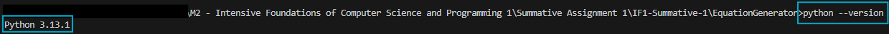
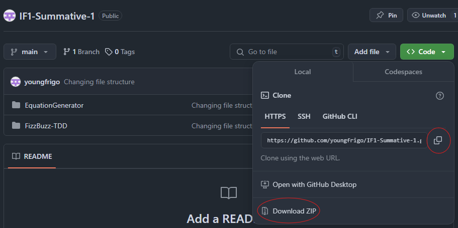
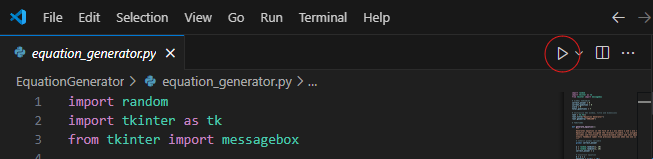
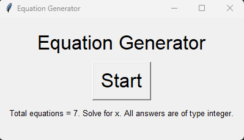
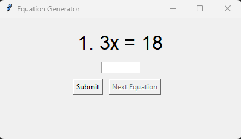
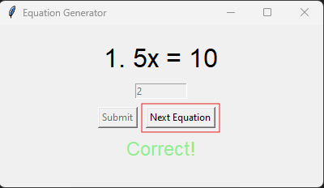
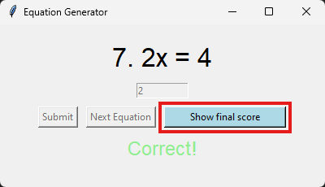
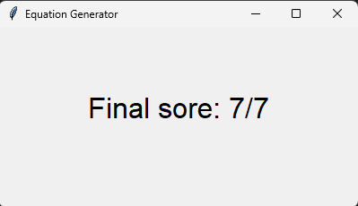
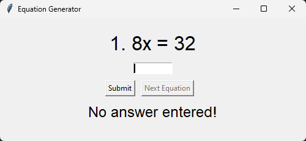
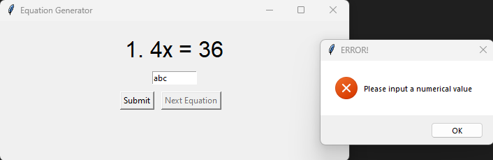

# Equation Generator Quiz Documentation

## Introduction

The Equation Generator program is a simple program that generates a certain number of basic equations in the form of: `a * x = b`

The program assigns random integers to a and x between 1 and 10, and then provides the opportunity for the user to submit an answer for x.

After validating the user’s answer, the program display’s a relevant message in the window; “Correct!” if the user’s answer matches the correct answer for x, and “Incorrect. The correct answer was x” is the user’s answer does not match the correct answer.

The user has one attempt at each question, and their score is tracked throughout the quiz. Once the final equation is answered, a button to see final score is displayed, and once clicked will display the user’s final score out of the total number of questions.

## User Guide

### Pre-requisites

There are some prerequisites that need to be completed to use the Equation Generator:

Install Python3

- The latest version of Python can be downloaded from the official Python website, https://www.python.org/downloads/. The latest version at the time of writing this document – January 2025 – is Python 3.13.1.


Install Visual Studio Code

- Visual Studio Code can be installed from it's official website, https://code.visualstudio.com/.
- (This is technically optional. You can use the python.exe application to run the python file for the equation generator. But it is recommended for code editing/reading)

Once you have opened Visual Studio Code you can confirm your Python install/version with the command: python --version



### Getting Started

Download the program

The program can be downloaded from GitHub. Either by cloning into a directory on your local PC, or by downloading the zip folder. The repository can be found at:

```
https://github.com/youngfrigo/IF1-Summative-1
```



### Running the program

If using Terminal/Command Prompt

- Open a terminal or a command prompt
- Using the "cd" command navigate to the repository where you have downloaded the program
- Run the program by typing "python equation_generator.py"

If using Python application

- Open the folder where you have downloaded and extracted the github repository
- Open the EquationGenerator folder and right-click the equation_generator.py
- Select "Open with" followed by "Python"

If using Visual Studio Code

- Launch Visual Studio Code once it has been installed
- Select "File" from the top menu, followed by "Open Folder" and select the "EquationGenerator" folder from the downloaded and extracted GitHub repository
- Once the file is opened you have 2 options to run:

Run using terminal:

- By selecting "Terminal" > "New Terminal", a terminal window will appear in your VS Code window
- Ensure you are in the correct directory, and run the command "python equation_generator.py"

Run using play button/code runner:

- Press the "play" button highlighted below



### How to Use the Program

The quiz loop is as follows:

1. Run the program
2. Read notes on main screen



3. Press "Start" when ready
4. Solve the equation for x



5. Submit your answer
6. Move on to the next equation



7. Repeat until all equations are answered



8. Display your final score



### Troubleshooting & tips

When using the program on a Mac with Dark Mode on, the buttons can be slighlty more difficult to see.
If you are using a Mac it is recommended to run the program whilst on Light Mode for easier readability

## Technical Documentation

### Overview

The Equation Generator program generates a simple algebraic equation in form of: `a * x = b`. The user is then tasked with solving the equation with
respect to x. The programs main functions include generating an equation with random values for a and x, providing feedback to the user when an
answer is submitted, tracking the user's score, and then displaying the user's score after all the equations have been answered.

### System Requirements

- Python 3 (currently latest is 3.13.1)
- Tkinter (comes pre-installed with Python)

### Code Structure

#### Imports

- import random: used to generate the numbers for a and x, between 1 and 10
- import tkinter as tk: main python library for the program
- from tkinter import messagebox: used in error checking the submitted value

#### Global variables

- correct_answer: variable to hold correct answer for current equation
- current_question: variable to count the index of current question
- score: tracks user score
- total_questions: used to set the total amount of questions

#### Main functions

- generate_equation
- start_quiz
- submit_answer
- show_score

#### Helper functions

- enable_submit, disable_submit
- enable_next_equation, disable_next_equation
- reset_entry_box, disable_entry_box

### Program Logic

1.  Once the program has been started, the generate equation functions generates two random
    numbers for a and x, calculates their product which is then assigned to b. The value of
    x is assigned to correct_answer.
2.  The user has one attempt for each equation. Once their answer is submitted, the submit
    button and entry box are disabled. The user's answer is validated against x/correct_answer
    and feedback regarding the result is displayed on screen. Once an answer is submitted, the
    next equation button is enabled. If the user's answer is correct, their score will be
    incremented.
3.  When a new equation is generated and displayed, the entry box is reset, and the submit
    button is enabled.
4.  Once all equations have been answered, the program will display a button to show the
    user's final score.

### Error Handling

1.  No answer entered:

- `if entry_box.get():` - this try statement checks to ensure that a value in the user entry box exists
- `else: feedback_label.config(text= "No answer entered!", fg="black")` - a false return from the above check results in an error message



2.  Invalid value entered:

- `try: user_answer = int(entry_box.get())` - try statement checks that the conversion of the submitted value to integer is successful
- `except ValueError: messagebox.showerror("ERROR!", "Please input a numerical value")` - except block with ValueError creates a popup to indicate an invalid value has been entered


