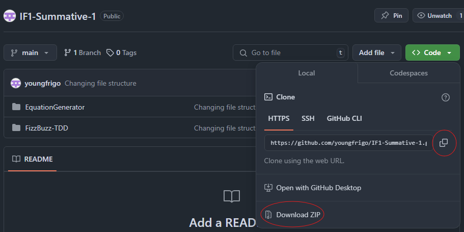

# Equation Generator Quiz Documentation

## Introduction

The Equation Generator program is a simple program that generates a certain number of basic equations in the form of:

                                                        a * x = b

The program assigns random integers to a and x between 1 and 10, and then provides the opportunity for the user to submit an answer for x.

After validating the user’s answer, the program display’s a relevant message in the window; “Correct!” if the user’s answer matches the correct answer for x, and “Incorrect. The correct answer was x” is the user’s answer does not match the correct answer.

The user has one attempt at each question, and their score is tracked throughout the quiz. Once the final equation is answered, a button to see final score is displayed, and once clicked will display the user’s final score out of the total number of questions.

## User Guide

### Pre-requisites

There are some prerequisites that need to be completed to use the Equation Generator:

Install Python3

- The latest version of Python can be downloaded from the official Python website, https://www.python.org/downloads/. The latest version at the time of writing this document – January 2025 – is Python 3.13.1.

Install Visual Studio Code

- Visual Studio Code can be installed from it's official website, https://code.visualstudio.com/.
- (This is technically optional. You can use the python.exe application to run the python file for the equation generator. But it is recommended for code editing/reading)

### Getting Started

Download the program

The program can be downloaded from GitHub. Either by cloning into a directory on your local PC, or by downloading the zip folder. The repository can be found at:

```
https://github.com/youngfrigo/IF1-Summative-1
```



### Running the program

If using Terminal/Command Prompt

- Open a terminal or a command prompt
- Using the "cd" command navigate to the repository where you have downloaded the program
- Run the program by typing "python equation_generator.py"

If using Python application

- Open the folder where you have downloaded and extracted the github repository
- Open the EquationGenerator folder and right-click the equation_generator.py
- Select "Open with" followed by "Python"

If using Visual Studio Code

- Launch Visual Studio Code once it has been installed
- Select "File" from the top menu, followed by "Open Folder" and select the "EquationGenerator" folder from the downloaded and extracted GitHub repository
- Once the file is opened you have 2 options to run:

Run using terminal:

- By selecting "Terminal" > "New Terminal", a terminal window will appear in your VS Code window
- Ensure you are in the correct directory, and run the command "python equation_generator.py"

Run using play button/code runner:

- Press the "play" button highlighted below


### How to Use the Program

The quiz loop is as follows:

1. Run the program
2. Read notes on main screen


3. Press "Start" when ready
4. Solve the equation for x


5. Submit your answer
6. Move on to the next equation


7. Repeat until all equations are answered


8. Display your final score


## Technical Documentation
